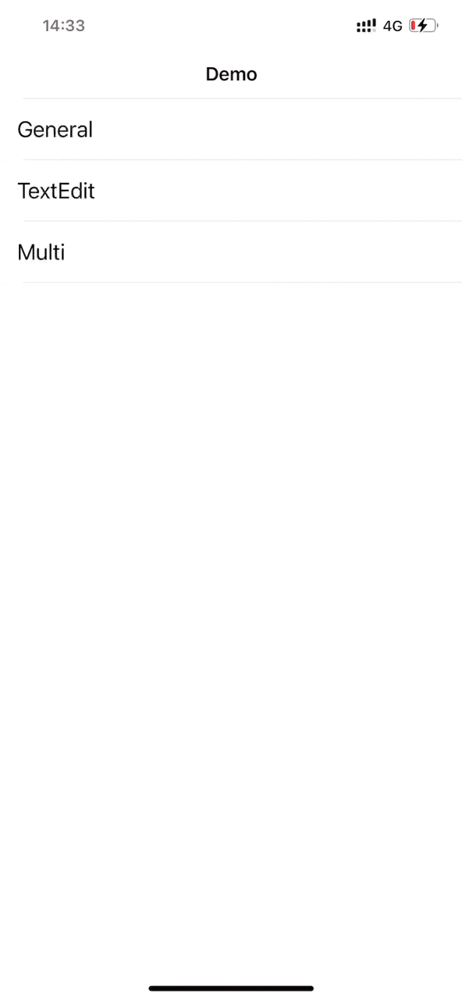

# Popup

A small and flexible custom pop-up view that can be used as a custom alertView, pop-up window, etc.

## Introduction

Various pop-up windows are often used in projects, so I encapsulated a small function to manage various pop-up windows more conveniently.

## Features

- The position and size of the pop-up window are completely customized by the user.
- Allow multiple popups to be displayed.
- You can update the position and size of the pop-up window.

## Preview



## Getting Start

### Requirements

- Deployment target iOS 11.0+
- Swift 5+
- Xcode 14+

### Installation

##### CocoaPods

```ruby
pod 'Popup'
```

Or

```ruby
pod 'Popup', :git => "https://github.com/liujunliuhong/Popup.git"
```

### Usage

##### Show popView

```swift
let popView = PopView1()

let backgroundTouchConfiguration = BackgroundTouchConfiguration(enable: true, animationProperty: .init(animation: true, duration: 0.25)) {
    print("Background Touch Dismiss")
}

Popup.show(groupKey: groupKey,
           popView: popView,
           animationProperty: .init(animation: true, options: [.curveLinear]),
           backgroundTouchConfiguration: backgroundTouchConfiguration) { popView in
    popView.snp.remakeConstraints { make in
        make.centerX.equalToSuperview()
        make.top.equalToSuperview { $0.snp.bottom }
        make.width.equalToSuperview().multipliedBy(0.7)
        make.height.equalTo(400)
    }
} destinationConstraintClosure: { popView in
    let size = popView.frame.size // you can get size
    popView.snp.remakeConstraints { make in
        make.center.equalToSuperview()
        make.size.equalTo(size)
    }
} dismissConstraintClosure: { popView in
    let size = popView.frame.size // you can get size
    popView.snp.remakeConstraints { make in
        make.centerX.equalToSuperview()
        make.top.equalToSuperview { $0.snp.bottom }
        make.size.equalTo(size)
    }
} completion: {
    print("completion")
}
```

##### Update destination position

```swift
Popup.updateDestination(groupKey: groupKey,
                        popView: popView) { popView in
    let size = popView.frame.size // you can get size
    popView.snp.remakeConstraints { make in
        make.left.equalToSuperview().offset(20)
        make.top.equalToSuperview().offset(100)
        make.size.equalTo(size)
    }
}
```

##### Update dismiss position

```swift
Popup.updateDismiss(groupKey: groupKey,
                    popView: popView) { popView in
    let size = popView.frame.size // you can get size
    popView.snp.remakeConstraints { make in
        make.left.equalToSuperview().offset(20)
        make.top.equalToSuperview { $0.snp.bottom }
        make.size.equalTo(size)
    }
}
```

##### Insert other popView

```swift
let popView = PopView2()

Popup.insert(groupKey: groupKey,
             popView: popView) { popView in
    popView.snp.remakeConstraints { make in
        make.centerY.equalToSuperview()
        make.left.equalToSuperview { $0.snp.right }
        make.width.height.equalTo(100)
    }
} destinationConstraintClosure: { popView in
    let size = popView.frame.size // you can get size
    popView.snp.remakeConstraints { make in
        make.center.equalToSuperview()
        make.size.equalTo(size)
    }
} dismissConstraintClosure: { popView in
    let size = popView.frame.size // you can get size
    popView.snp.remakeConstraints { make in
        make.centerY.equalToSuperview()
        make.left.equalToSuperview { $0.snp.right }
        make.size.equalTo(size)
    }
}
```

##### Dismiss all popViews managed by groupKey

```swift
Popup.dismiss(groupKey: groupKey)
```

### About Keyboard

If there is an `UITextField` or `UITextView` in your pop-up window and it is not blocked by the keyboard, you can import a third-party library for keyboard management, such as [IQKeyboardManager](https://github.com/hackiftekhar/IQKeyboardManager).

### Author

liujun, universegalaxy96@gmail.com

